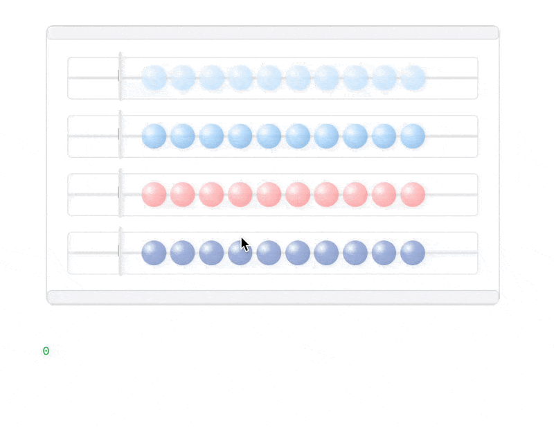

# st_abacus

Introducing a better way to count, all the way back to the abacus. Count up in 10s, 100s, and 1000s faster than you can say "one thousand one hundred one". st_abacus will return the calculated value of the abacus, live as your user is moving the beads from one side to another.



## Installation instructions

```sh
pip install st_abacus
```

## Usage instructions

```python
import streamlit as st

from st_abacus import st_abacus

value = st_abacus()

st.write(value)
